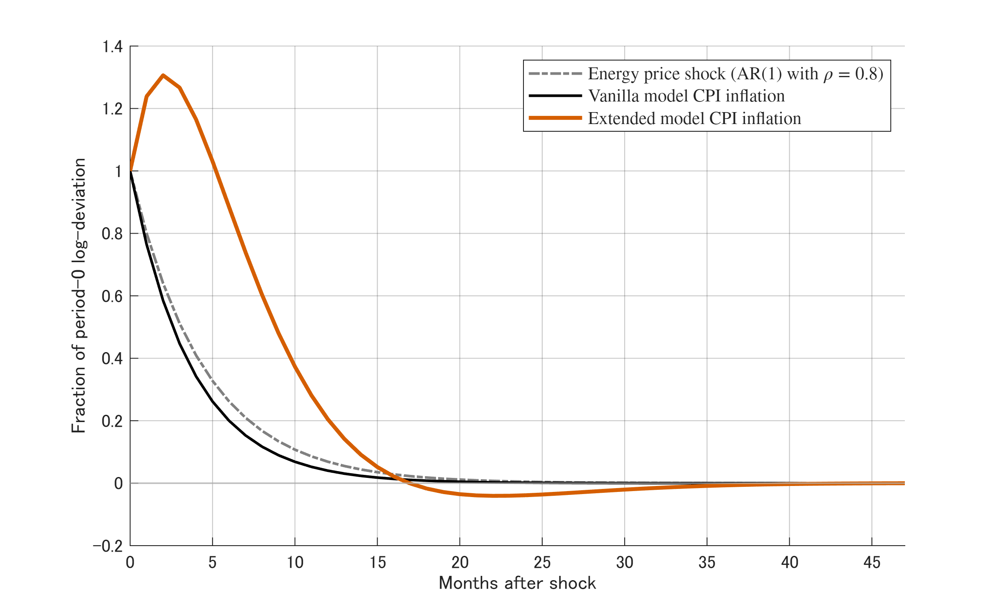

## Inflation Persistence After an Energy-Price Shock

{height=80% fig-align="center"}

\pause

**Puzzle**: The vanilla New Keynesian model *fails* to replicate the inflation persistence

## Three Extensions to Generate Inflation Persistence

\pause

1. **Vertical Production Network**

```{=latex}
\centering
\begin{tikzpicture}[
    node distance=2.4cm,
    box/.style={
        draw, rounded corners=4pt, 
        minimum width=2.8cm, minimum height=1.3cm, 
        align=center, font=\normalsize,
        line width=0.6pt
    },
    input/.style={
        font=\normalsize\itshape, text=black!70
    },
    arr/.style={
        -{Stealth[length=6pt]}, line width=0.8pt
    },
    arrlabel/.style={
        font=\small, midway, above, align=center, text=black!70
    }
]

\node[input] (energy) {Energy};
\node[box, right=0.9cm of energy] (upstream) {\textbf{Upstream}\\\textbf{Firms}};
\node[box, right=of upstream] (downstream) {\textbf{Downstream}\\\textbf{Firms}};
\node[box, right=1.5cm of downstream] (consumers) {\textbf{Consumers}};
\node[input, below=0.9cm of $(upstream)!0.5!(downstream)$] (labour) {Labour};

\draw[arr] (energy) -- (upstream);
\draw[arr] (upstream) -- node[arrlabel] {intermediate\\goods} (downstream);
\draw[arr] (downstream) -- node[arrlabel] {final\\goods} (consumers);
\draw[arr] (labour) -- (upstream);
\draw[arr] (labour) -- (downstream);

\node[font=\small\bfseries, above=0.4cm of energy, text=red!70!black] (shock) {Shock};
\draw[-{Stealth[length=5pt]}, red!70!black, dashed, line width=0.6pt] (shock) -- (energy);

\end{tikzpicture}
```
\pause

2. Downstream Firms' **Myopia** in Price Setting `{\scriptsize (Minton \& Wheaton 2023, Gabaix 2020 AER)}`{=latex}

- Difficult to forecast future prices of intermediate goods
  - In pricing decisions, place more weight on current costs than future expectations

\pause

3. **Real Wage Rigidity** in the Labour Market `{\scriptsize (Blanchard \& Galí 2007 JMCB)}`{=latex}

- Wages adjust slowly to productivity changes due to frictions in the labour market

## Results

{height=70% fig-align="center"}

- Three-month lag in the peak inflation response + persistence