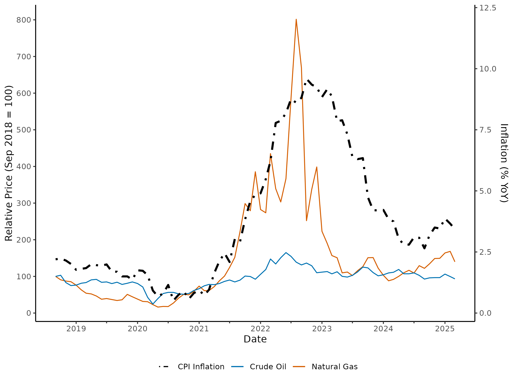
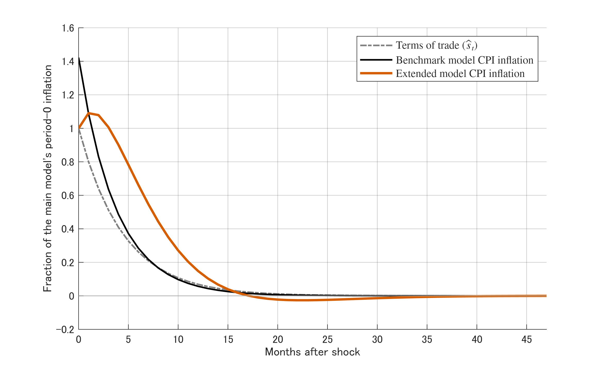
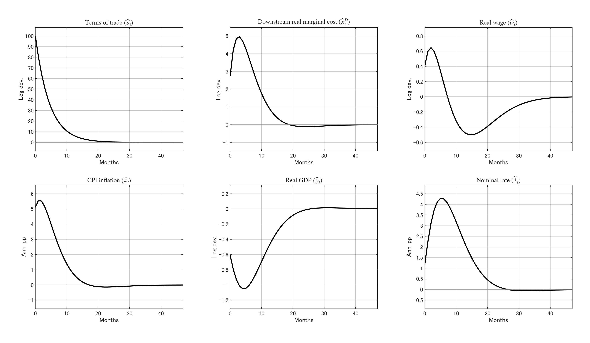
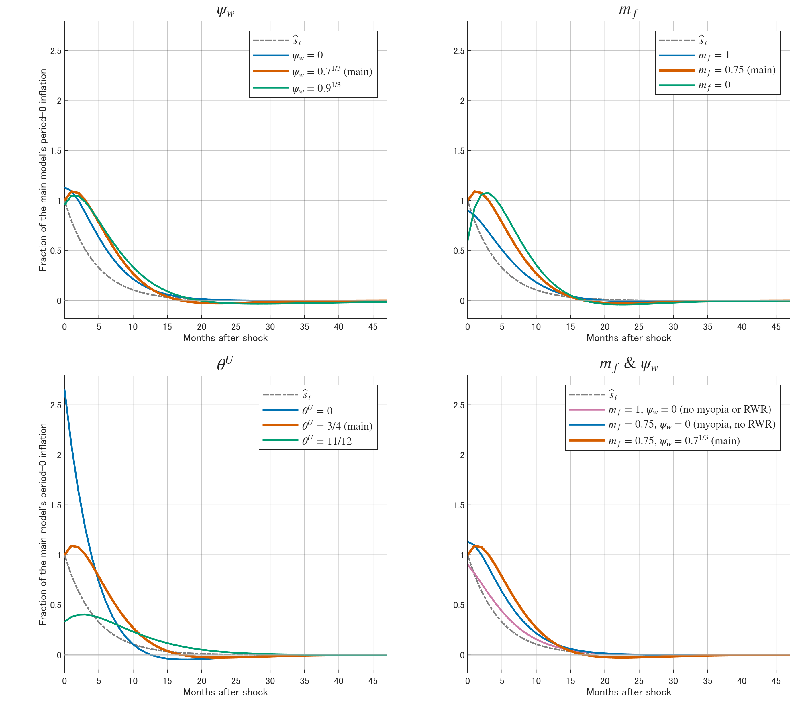
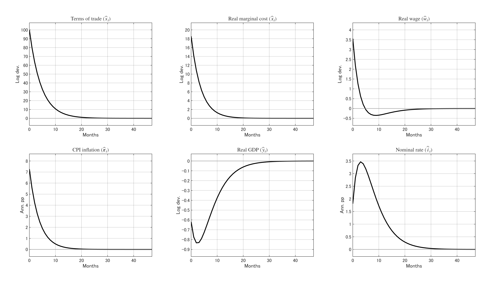
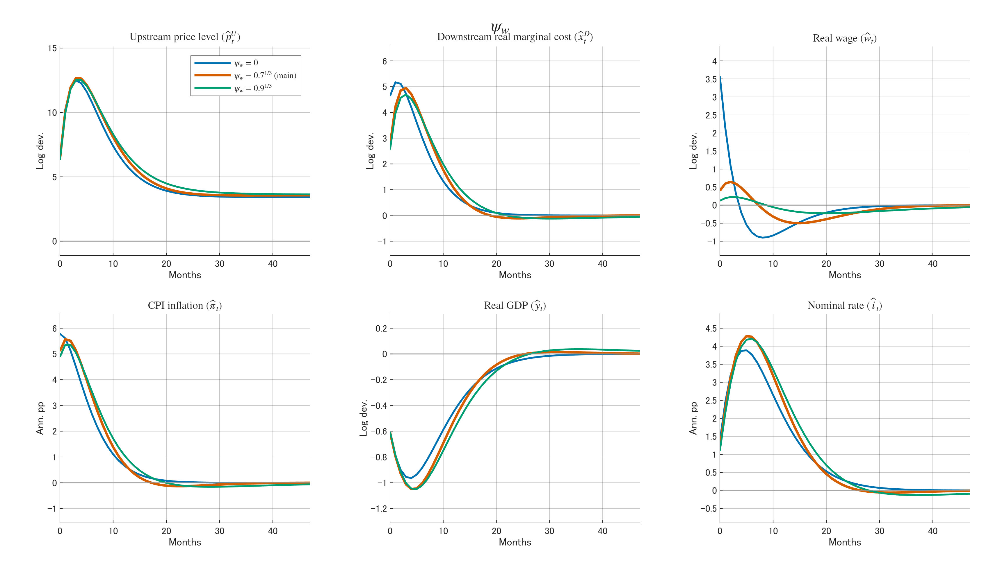
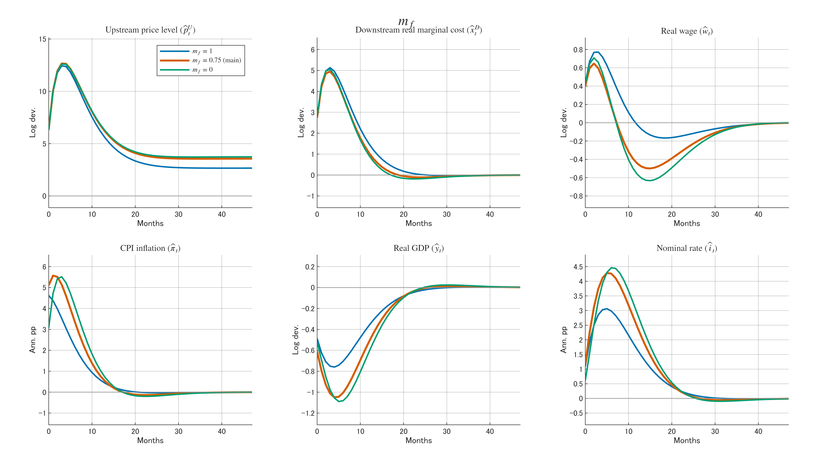
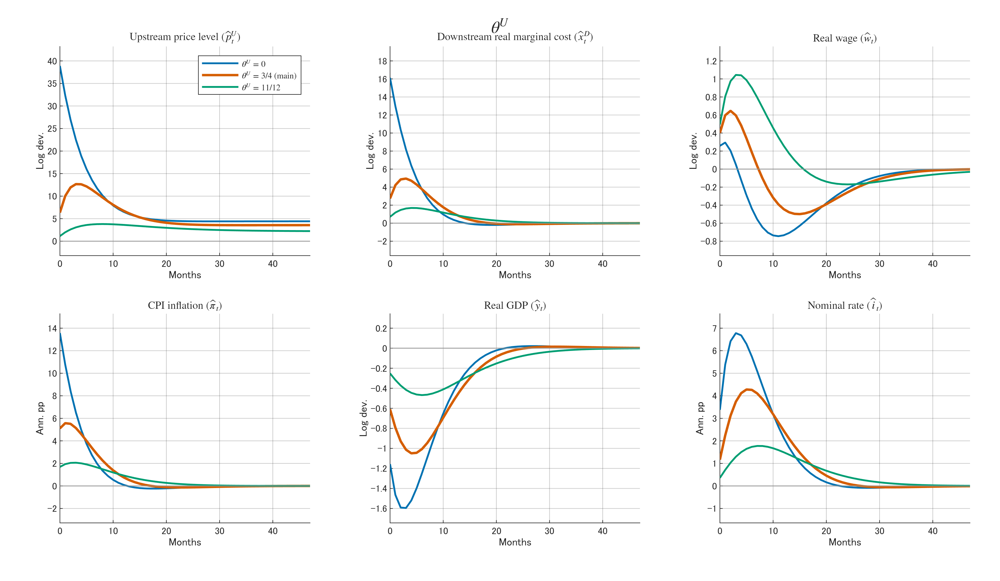
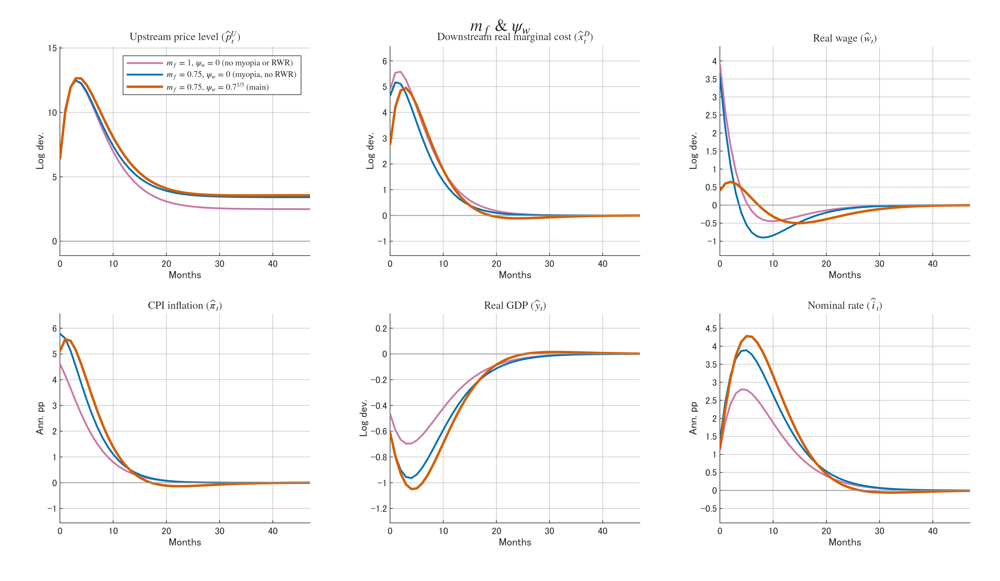

## Observations in the UK

{height=85% fig-align="center"}

---

What happened in the UK after the gas price spike?

- Natural gas price decreased relatively quickly; CPI inflation decreased **more slowly**.
- **Few months lag** between the peak of gas price and the peak of CPI inflation.
- CPI inflation did not return to the pre-shock level^[\tiny I do not feature this in my model in fear of simultaneous trends.]

## Three Model Extensions from the Baseline

### 1. **\textcolor{black}{Production network}**

- Structured vertically with upstream and downstream industries
  - Upstream industry: energy $+$ labour $\longrightarrow$ intermediate goods
  - Downstream industry: intermediate goods $+$ labour $\longrightarrow$ final consumption goods
- Production function remains Leontief for both sectors
- Competitive sector remains unchanged, producing tradable goods using labour only for the balance of payments equilibrium
- Single labour market with free mobility ($\implies$ equal wage across sectors)

---

### 2. **\textcolor{red}{Myopia}** \textcolor{black}{in downstream firms' Calvo reset price determination}
- @minton2023delayed; @gabaix2020behavioral
- Firms are reluctant / difficult to forecast the future, and thus discount the future expectations
- The myopic expectation of $\hat{v}_{t+k}$ (in log-linearised form) is

$$
\tilde{\E}_t[\hat{v}_{t+k}] \equiv m_f^k \E_t[\hat{v}_{t+k}],
$$

- where $m_f \in [0,1]$ with $m_f = 1$ being completely rational

### 3. **\textcolor{blue}{Real wage rigidity}** \textcolor{black}{in the labour market}
- @blanchard2007real
- Only a fraction $1 - \psi_w$ of the gap between the actual real wage $\hat w_t$ and the flexible real wage $\hat w^f_t$ is adjusted in each period:

$$
\hat{w}_t = \psi_w \hat{w}_{t-1} + (1-\psi_w)\hat w^f_t,
$$

- where $\psi_w \in [0,1]$ with $\psi_w = 0$ being completely flexible

## Log-Linearised Model Equations 1/2
$$
\begin{aligned}
  \hat{y}_t &= \hat{L}_t - \alpha^U \alpha^D \hat{s}_t & \text{(aggregate production function)} \\
  \hat{x}^D_t &= \Phi_{DU}(\hat{p}^U_t - \hat{p}^D_t) + (1-\Phi_{DU})\hat{w}_t & \text{(downstream real marginal cost)} \\
  \hat{X}^D_t &= \hat{x}^D_t + \hat{p}^D_t & \text{(downstream nominal marginal cost)} \\
  \hat{X}^U_t &= \alpha^U \hat{s}_t + \hat{w}_t + \hat{p}^D_t & \text{(upstream nominal marginal cost)} \\
  \hat w^f_t &= \frac{1}{\sigma}\hat y_t + \frac{1}{\psi}\hat{L}_t & \text{(flexible real wage)} \\
  {\color{blue}\hat{w}_t} &= {\color{blue}\psi_w \hat{w}_{t-1} + (1-\psi_w)\hat w^f_t} & {\color{blue}\text{(real wage rigidity)}} \\
\end{aligned}
$$

## Log-Linearised Model Equations 2/2
$$
\begin{aligned}
  \hat{\pi}_t &= \hat{p}^D_t - \hat{p}^D_{t-1} & \text{(CPI inflation)} \\
  \hat{p}^D_t &= \theta^D \hat{p}^D_{t-1} + (1-\theta^D)\hat{p}^{D*}_t & \text{(downstream Calvo price level)} \\
  {\color{red}\hat{p}^{D*}_t} &= {\color{red}\beta m_f \theta^D \E_t[\hat{p}^{D*}_{t+1}] + (1-\beta m_f \theta^D)\hat{X}^D_t} & {\color{red}\text{(downstream reset price)}} \\
  \hat{p}^U_t &= \theta^U \hat{p}^U_{t-1} + (1-\theta^U)\hat{p}^{U*}_t & \text{(upstream Calvo price level)} \\
  \hat{p}^{U*}_t &= \beta \theta^U \E_t[\hat{p}^{U*}_{t+1}] + (1-\beta\theta^U)\hat{X}^U_t & \text{(upstream reset price)} \\
  \hat{y}_t &= \E_t[\hat{y}_{t+1}] - \sigma(\hat{i}_t - \E_t[\hat{\pi}_{t+1}]) & \text{(IS equation)} \\
  \hat i_t &= \phi\hat i_{t-1} + (1 - \phi)(\chi_\pi\hat\pi_t + \chi_y\hat y_t) & \text{(Taylor rule)} \\
  \hat s_t &= \rho \hat s_{t-1} + u_t & \text{(Terms of trade AR(1) process)}
\end{aligned}
$$

## Parameter Calibration

\begin{table}[htbp]
\centering
\tiny
\begin{tabular}{lcc}
\toprule
Parameter & Symbol & Value \\
\midrule
\textit{Households} \\
Discount factor & $\beta$ & 0.9984 \\
Elasticity of intertemporal substitution & $\sigma$ & 0.5 \\
Frisch elasticity of labour supply & $\psi$ & 3 \\
\midrule
\textit{Production and cost structure} \\
Energy cost share (upstream) & $\alpha^U$ & 0.375 \\
Intermediate input share (downstream) & $\alpha^D$ & 0.4 \\
Elasticity of substitution & $\varepsilon$ & 11 \\
Downstream's intermediate good-cost share & $\Phi_{DU}$ & 0.4231 (implied) \\
\midrule
\textit{Price setting} \\
Downstream Calvo probability & $\theta^D$ & 11/12 \\
Upstream Calvo probability & $\theta^U$ & 3/4 \\
Myopia parameter (downstream) & $m_f$ & 0.5 \\
\midrule
\textit{Labour market} \\
Real wage rigidity & $\psi_w$ & $0.7^{1/3} \approx 0.888$ \\
\midrule
\textit{Monetary policy} \\
Interest-rate smoothing & $\phi$ & 0.9 \\
Inflation response & $\chi_\pi$ & 3 \\
Output response & $\chi_y$ & 0.5 \\
\midrule
\textit{Shock process} \\
Terms of trade persistence & $\rho$ & 0.8 \\
\bottomrule
\end{tabular}
\end{table}

---

### Energy cost share (upstream): $\alpha^U = 0.375$

- Output-weighted ave. energy cost share across eight most energy-intensive sectors^[\tiny Electric Power Generation, Gas Manufacture & Distribution, Industrial Gases, Inorganics, Fertilisers, Petrochemicals, Paper and Paper Products, Glass, Ceramics, Stone, Basic Iron and Steel, and Other Basic Metals & Casting]
  - Model's weak point: those sectors produce final consumption goods in reality
- Based on the input-output table of the UK economy 2017-2022 by ONS

### Intermediate input share (downstream): $\alpha^D = 0.4$

- So that the energy cost share in the final consumption goods is $\alpha^U \alpha^D = 0.15$

### Downstream's intermediate good-cost share: $\Phi_{DU} = 0.4231$ (implied)
$$
\Phi_{DU} = \frac{\alpha^D\mu}{1 - \alpha^D + \alpha^D\mu} = 0.4231
$$

- Cost-based share of intermediate goods in the downstream real marginal cost
- Takes into account the upstream industry's markup on the intermediate goods
  - cf. $\alpha^D = 0.4$ does not

---

### Upstream Calvo probability: $\theta^U = 3/4$

- Average price duration of 4 months
- @nakamura2008five: prices for intermediate goods are more flexible than those for final consumption goods
- Sensitivity analysis with $\theta^U \in \{0.5, 3/4, 11/12\}$

### Myopia parameter (downstream): $m_f = 0.5$

- The mid-point of the parameter space $[0,1]$ given the variety of intermediate goods
- Sensitivity analysis with $m_f \in \{0, 0.5, 1\}$

### Real wage rigidity: $\psi_w = 0.7^{1/3} \approx 0.888$

- The mid point of the two sample values in @blanchard2007real in monthly frequency
- Sensitivity analysis with $\psi_w \in \{0, 0.7^{1/3}, 0.9^{1/3}\}$

Other parameters are calibrated to standard values in the literature.

## Results

{height=70% fig-align="center"}

- \small CPI inflation of both models is normalised based on my model's initial response

---

{height=85% fig-align="center"}

---

### Downstream Real Marginal Cost $\hat x^D_t$
- peaks at 5.0\% with a three-month lag
- Lag is due to the upstream Calvo pricing $+$ real wage rigidity

### Real Wage $\hat w_t$
- High $\hat s_t$ demands more labour for the competitive sector
  - This offsets the negative effect due to the productivity decrease
- After the peak, nominal interest rate will be raised to stabilise inflation, which decreases labour demand
  - But adjustment is slow due to real wage rigidity

### CPI Inflation $\hat \pi_t$

- Peaks at 5.6\% with a three-month lag
  - Myopia of the downstream firms contributes to the lag and persistence

## Sensitivity Analysis (IRFs in Appendix)

{height=85% fig-align="center"}

---

### Real Wage Rigidity $\psi_w$

- No real wage rigidity ($\psi_w = 0$):
  - Inflation responds immediately with initial response almost as high as its peak in one month
- Higher real wage rigidity ($\psi_w = 0.9^{1/3}$):
  - Slightly smaller response peak 
  - But inflation is more persistent with a slower decay

### Downstream Firm Myopia $m_f$

- No myopia / completely rational ($m_f = 1$):
  - Inflation decreases monotonically after the initial shock
  - Correct expectations that energy price will only decrease back to the steady state level
- Full myopia ($m_f = 0$):
  - Initial inflation response is smaller
  - but catches up in four months to reach the almost same peak

---

### Upstream Calvo Probability $\theta^U$

### Combination: Myopia $m_f$ and Real Wage Rigidity $\psi_w$

## References

::: {#refs}
:::

# Appendix

## The Baseline Model {.appendix}

$$
\begin{aligned}
  \hat{y}_t &= \hat{L}_t - \alpha \hat{s}_t & \text{(aggregate production function)} \\
  \hat{x}_t &= \hat{w}_t + \alpha \hat{s}_t & \text{(real marginal cost)} \\
  \hat{X}_t &= \hat{x}_t + \hat{P}_t & \text{(nominal marginal cost)} \\
  \hat{w}_t &= \frac{1}{\sigma}\hat{y}_t + \frac{1}{\psi}\hat{L}_t & \text{(labour supply)} \\
  \hat{\pi}_t &= \hat{P}_t - \hat{P}_{t-1} & \text{(inflation)} \\
  \hat{P}_t &= \theta \hat{P}_{t-1} + (1-\theta)\hat{P}_t^* & \text{(Calvo price level)} \\
  \hat{P}_t^* &= \beta\theta\mathbb{E}_t[\hat{P}_{t+1}^*] + (1-\beta\theta)\hat{X}_t & \text{(reset price)} \\
  \hat{y}_t &= \mathbb{E}_t[\hat{y}_{t+1}] - \sigma\bigl(\hat{i}_t - \mathbb{E}_t[\hat{\pi}_{t+1}]\bigr) & \text{(IS equation)} \\
  \hat{i}_t &= \phi\hat{i}_{t-1} + (1-\phi)\bigl(\chi_\pi \hat{\pi}_t + \chi_y \hat{y}_t\bigr) & \text{(Taylor rule)} \\
  \hat{s}_t &= \rho\hat{s}_{t-1} + u_t & \text{(terms-of-trade shock)}
\end{aligned}
$$

---

\begin{table}[htbp]
\centering
\small
\begin{tabular}{lcc}
\toprule
Parameter & Symbol & Value \\
\midrule
\textit{Households} \\
Discount factor & $\beta$ & 0.9984 \\
Elasticity of intertemporal substitution & $\sigma$ & 0.5 \\
Frisch elasticity of labour supply & $\psi$ & 3 \\
\midrule
\textit{Production and cost structure} \\
Energy cost share & $\alpha$ & 0.15 \\
\midrule
\textit{Price setting} \\
Calvo probability & $\theta$ & 11/12 \\
\midrule
\textit{Monetary policy} \\
Interest-rate smoothing & $\phi$ & 0.9 \\
Inflation response & $\chi_\pi$ & 3 \\
Output response & $\chi_y$ & 0.5 \\
\midrule
\textit{Shock process} \\
Terms of trade persistence & $\rho$ & 0.8 \\
\bottomrule
\end{tabular}
\end{table}

---

{height=85% fig-align="center"}

## Impulse Responses from Sensitivity Analysis {.appendix}

{height=85% fig-align="center"}

---

{height=90% fig-align="center"}

---

{height=90% fig-align="center"}

---

{height=90% fig-align="center"}
